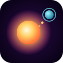

# Gravitator

**Eat rocks. Grow. Become a star.**

A 2D gravity sandbox for **Godot 4.7** (latest stable). The universe is full of stars, every star has planets, planets have moons, and between them drift asteroid belts full of snack-sized rocks. Everything is made of the same nondescript material, everything pulls on everything else, and the heavier something is, the more it glows.

You start as a little rock. Your only controls are **where you aim** and **when you thrust**. Thrusting blasts part of your own mass away from the cursor, and the recoil pushes you toward it. Mass is fuel, but growing is the goal, so every burst is a trade.



## Running it

1. Install **Godot 4.7** (the standard build; .NET isn't needed).
2. Open the project (`project.godot`) in the editor and press **F5**, or run it from a terminal:

   ```sh
   godot --path .
   ```

The game uses the **Forward+** renderer (Vulkan / Direct3D 12 / Metal) with HDR 2D and bloom.

## Controls

| Input | Action |
|---|---|
| Mouse | Aim |
| **Space** / left click | Thrust: eject mass away from the cursor, move toward it. Hold to keep firing. |
| Mouse wheel, `+` / `-` | Zoom out / in (the camera also scales automatically as you grow) |
| `T` | Toggle trajectory prediction |
| `P` / `Esc` | Pause |
| `R` | New universe |
| `H` / `F1` | Show the control hints again |
| `F3` | Debug overlay (FPS, body count, tree and gravity timings) |
| `F8` | Autopilot (attract mode) |

## Rules

- **Collisions:** when two bodies touch, the lighter one is absorbed into the heavier one. Momentum is conserved, and the colours blend by mass.
- **Structural integrity:** every body has a binding energy that grows with its mass: material strength for small rocks, self-gravity for planets and stars. If the impact energy exceeds the smaller body's binding energy, it **shatters**: part of it sticks and the rest sprays off as fragments. Anything too slow to escape falls back in. If the impact overcomes both bodies, both are torn apart in a **catastrophic** collision.
- **Game over:** you die if you're **shattered**, or if you touch something bigger and get **consumed**. The universe keeps running. One of the pieces from your death is picked as your next rock (it's marked with a pulsing ring), and **Space** brings you back as that fragment, with a few seconds of ghosting.
- **Heat:** impacts turn kinetic energy into heat. Hot bodies glow through molten fissures, then radiate the heat away. Small things cool fast; big things hold heat for a long time.
- **Fusion:** at **6 million** mass, a body ignites and sustains its own heat, becoming a star. That includes you.
- **Help:** red rims mark bodies bigger than you. Green arrows at the screen edge point to nearby prey, and red arrows to big things closing in on you. The dotted line is your predicted path.

Ranks: Dust → Pebble → Rock → Boulder → Asteroid → Planetesimal → Moonlet → Moon → Planet → Giant → **Star** → Giant Star → Hypergiant.

## How the simulation works

All of it lives in `scripts/sim/`, written in GDScript with no native code.

- **Bodies are spheres of one material.** Radius comes from volume, `r = cbrt(3m / 4πρ)`, with a single standard density `Phys.DENSITY`.
- **Gravity uses a Barnes-Hut tree** (`barnes_hut.gd`). In 2D the octree becomes its 2D form, a quadtree (each cell splits into 2^dims = 4 children). The tree is rebuilt every step from Morton-sorted bodies: codes are sorted natively and cells are carved from runs of shared code prefixes. The force walk is stackless (skip pointers) and runs in parallel on `WorkerThreadPool`.
- **Precision at the player's level:**
  - The opening angle θ is chosen *per receiving body*. The player gets θ = 0.25, its neighbourhood 0.4, and θ loosens with distance up to 1.0.
  - Bodies far from the player also use **multi-rate leapfrog**. They still move every step, but only get fresh forces every third step, which keeps the integrator symplectic. Everything near you runs at full rate.
- **Collision detection comes free with the gravity walk.** Each cell's bounding radius includes its bodies' radii plus their motion over the step. The walk always opens cells it might touch, so every candidate pair is found, and a swept closest-approach test catches fast bodies that would otherwise tunnel through.
- **Integration** is kick-drift-kick leapfrog at a fixed 60 Hz, with render interpolation. Time can be dilated for hit-stop and slow motion.
- Typical load is roughly 1,000–1,600 bodies at about 5–8 ms per step on a 4-core machine.

## Visuals and audio

- **Bodies:** one MultiMesh draw with a custom shader. Each body is a lit, rotating, noise-textured sphere. It faces the brightest nearby star, ripples when it absorbs something, and heats up through glowing fissures to fully molten. Stars get churning plasma, limb darkening and corona rays. A halo grows with mass, and HDR bloom makes heavy and hot things blaze.
- **Effects:** sparks, flashes, shockwaves, implosions and ignition bursts are animated entirely on the GPU. Each one is written once into a ring buffer and never touched again.
- **Screen:** the post shader adds shockwave distortion, chromatic aberration, flashes and desaturation on death. Screen shake, zoom punch, hit-stop and slow motion scale with how big an impact looks on screen.
- **Background:** a parallax starfield and domain-warped nebulae.
- **Audio:** every sound is synthesised at startup, with no audio files. There's a bloop that drops in pitch the more you swallow, a gulp, a thud, a crack, a boom, thrust whooshes, a stellar-ignition swell and an ambient drone.

## Tuning

Almost every gameplay number is in `scripts/sim/phys.gd`: gravitational constant, density, material strength, heat, fusion threshold, thrust fraction and exhaust speed, rebirth grace, Barnes-Hut θ values, and the rank table. The universe layout (star count, system sizes, belts) is in `scripts/sim/generator.gd`.

## Command-line options

Pass these after `--`, for example `godot --path . -- --seed=42 --autoplay`.

| Flag | Effect |
|---|---|
| `--seed=N` | Deterministic universe layout (the simulation itself is multithreaded and may diverge) |
| `--stars=N` | Number of star systems (default 8) |
| `--autoplay` | Start with the autopilot on |
| `--debug` | Start with the debug overlay |
| `--mass=N` | Start with a heavier rock (skip ahead) |
| `--zoom=N` | Extra zoom-out factor |
| `--gallery` | A line-up of bodies across the mass and heat range, for checking the shaders |

## Tests

These are headless and need no GPU:

```sh
godot --headless --path . --import                                   # once, builds the class cache
godot --headless --path . -s tests/sim_smoke.gd                      # 10 s of simulation: timing, mass conservation, NaNs
godot --headless --path . --fixed-fps 60 -s tests/play_test.gd -- --autoplay   # 3 min of autopilot play
```

These are visual scripts; record them with Movie Maker:

```sh
godot --path . --write-movie out.png --fixed-fps 30 -s tests/death_demo.gd
godot --path . --write-movie out.png --fixed-fps 30 -s tests/ignite_demo.gd
```

## Project layout

```
scenes/main.tscn              entry scene (everything else is built in code)
scripts/main.gd               game loop, camera, input, event-driven effects, game flow, autopilot
scripts/sim/phys.gd           constants, tuning, physics helpers
scripts/sim/universe.gd       body storage, integration, collisions, heat, fusion, thrust
scripts/sim/barnes_hut.gd     threaded Barnes-Hut quadtree (2D octree)
scripts/sim/generator.gd      star systems, planets, moons, rings, belts
scripts/render/*.gd           body renderer, GPU effects, world overlay (trail, trajectory, popups)
scripts/audio/sfx.gd          procedural sound synthesis
scripts/ui/hud.gd             HUD, notices, game-over panel, edge indicators
shaders/*.gdshader            body, spark, ring, background, post-processing
tests/                        headless and visual checks
```
